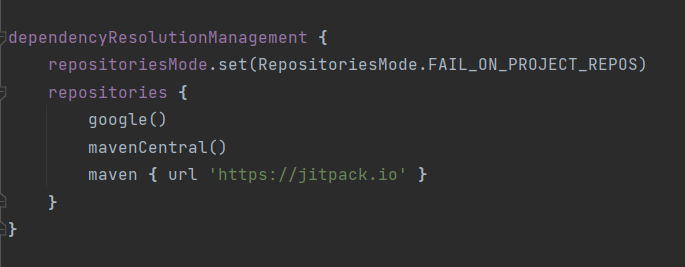
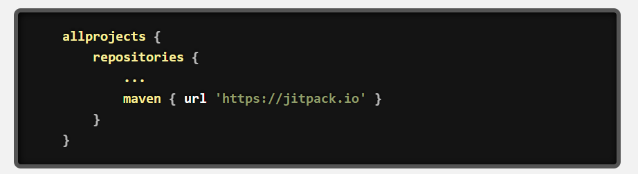

# [MyCover.ai](https://www.mycover.ai/) Insurance SDK

<div align="center">
      
</div>

An android SDK built natively with kotlin and Jetpack Compose, for buying insurance policies, powered by the [mycover.ai](https://www.mycover.ai/) platform.

## Add the dependencies to your gradle files

### add the jitpack maven repo in your settings.gradle file
<div align="center">
      
</div>

### Or if you're using an older gradle version(root level build.gradle)
<div align="center">
      
</div>

### in your module level build.gradle file, add the mycover.ai sdk dependency
```gradle

dependencies {
    implementation 'com.github.ibuildgenius:mca-android-sdk:<latest-version>'
}

```

## Usage
Initialise the sdk 

```kotlin

MyCoverAI.init(this, "<YOUR-API-TOKEN>")


```